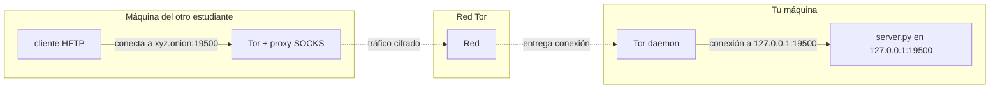

# Guía práctica: Servidor HFTP como servicio Tor (.onion)

Esta guía permite publicar tu servidor HFTP del Laboratorio 2 como **servicio oculto Tor** (dirección `.onion`) para compartir archivos con otros estudiantes desde casa, sin abrir puertos en el router ni exponerte directamente en Internet.

> **Relación con el enunciado del Lab 2:** El laboratorio se evalúa **aprobado / no aprobado** (sin nota numérica). **Demostrar HFTP extremo a extremo vía Tor** es un **requisito obligatorio** de la entrega (mismo protocolo, otro camino TCP). Esta guía es el documento de referencia operativa para esa parte; no duplica el enunciado ni sustituye la entrega del servidor y cliente HFTP en el repositorio Git del lab. Para una visión general de la red Tor (conceptos, privacidad, proyecto), ver [torproject.org](https://www.torproject.org/).

**Requisitos:** Linux (Debian/Ubuntu), servidor y cliente HFTP del Lab2 funcionando en red local.

---

## Cómo funciona en la práctica (resumen)

Hay **dos roles**: quien **publica** el servidor (tú) y quien **se conecta** (otro estudiante). Cada uno hace cosas distintas.

### Si tú eres quien publica el servidor (otros se conectan a ti)

1. **Tor tiene que estar instalado y corriendo** en tu máquina (`sudo systemctl status tor` → `active`).
2. **Dices a Tor**: “Cuando alguien conecte a mi dirección .onion en el puerto 19500, reenvía esa conexión a mi propio `127.0.0.1:19500`.” Eso se hace en el archivo **`/etc/tor/torrc`** (o con el script `scripts/tor/setup_tor_hftp.sh`).
3. **Reinicias Tor** para que lea esa configuración (`sudo systemctl restart tor`).
4. **Obtienes tu dirección .onion** (ej.: `abc123.onion`) con `sudo cat /var/lib/tor/hftp_service/hostname`. Esa es la “URL” que compartes.
5. **Arrancas tu servidor HFTP** escuchando en **127.0.0.1** y puerto **19500**. El servidor no sabe nada de Tor: solo ve conexiones TCP que llegan a ese puerto; Tor es quien las inyecta ahí.
6. Cuando alguien conecta a `abc123.onion:19500` desde la red Tor, **Tor entrega esa conexión a tu proceso Tor local**, y este la reenvía a `127.0.0.1:19500`, donde está tu `server.py`. Tu servidor ve una conexión normal.

En resumen: **Tor = intermediario**. Tu máquina no abre el puerto 19500 al mundo; solo habla con Tor en local. Tor es quien recibe las conexiones en la red .onion y te las pasa a localhost.

### Si tú eres quien se conecta (a un servidor .onion de otro)

1. **Tor tiene que estar corriendo** en tu máquina también.
2. El otro te da su dirección **.onion** (ej.: `xyz789.onion`).
3. Tu **cliente HFTP** no sabe hablar con .onion directamente. Por eso usas **torsocks**: hace que todo el tráfico del cliente pase por el proxy de Tor (127.0.0.1:9050). Así, cuando el cliente “conecta” a `xyz789.onion:19500`, en realidad es Tor quien establece esa conexión por la red Tor.
4. Comando: `torsocks python client.py xyz789.onion 19500` (o el script `scripts/tor/run_client_tor.sh xyz789.onion`).

### Diagrama del flujo (tú publicas, otro se conecta)



**Orden recomendado la primera vez (quien publica):** instalar Tor → ejecutar `sudo ./scripts/tor/setup_tor_hftp.sh` → anotar la .onion que imprime → arrancar el servidor con `./scripts/tor/run_server_tor.sh` (o `python server.py -a 127.0.0.1 -p 19500`). A partir de ahí, cada vez que quieras ofrecer el servidor: solo arrancar Tor (si no está) y el servidor HFTP; la .onion no cambia.

---

## 1. Explicación breve del concepto

### ¿Qué es Tor?

**Tor** (The Onion Router) es una red overlay que enruta el tráfico a través de varios nodos voluntarios. Los datos se cifran en capas (de ahí lo de “cebolla”): cada nodo solo conoce al anterior y al siguiente, no el origen ni el destino final. Tor permite navegar y ofrecer servicios de forma que no hace falta exponer tu IP ni abrir puertos en tu router.

### ¿Qué es un Onion Service?

Un **onion service** (antes “servicio oculto”) es un servidor que solo se anuncia dentro de la red Tor. Tiene una dirección que termina en `.onion` (por ejemplo `abc123xyz456.onion`). Los clientes se conectan a esa dirección a través de Tor; la conexión llega a tu máquina mediante el **daemon Tor local**, que reenvía el tráfico a un proceso que escucha en tu propio ordenador (por ejemplo tu servidor HFTP en `127.0.0.1:19500`).

### ¿Por qué esto permite atravesar NAT sin abrir puertos?

Con NAT doméstico (o CGNAT), tu router no acepta conexiones entrantes desde Internet. Con Tor no hace falta: **tu máquina se conecta hacia la red Tor**; Tor mantiene ese “tubo” y, cuando alguien conecta a tu dirección `.onion`, es la red Tor quien entrega esa conexión a tu daemon Tor local, y este la reenvía a `127.0.0.1:19500`. Todo el tráfico entrante llega por esa conexión saliente que ya abriste tú. No tienes que abrir el puerto 19500 en el router.

### El protocolo HFTP no cambia

Tu aplicación (servidor y cliente HFTP) sigue usando el mismo protocolo sobre TCP. Lo que cambia es **cómo llega** ese TCP: en lugar de ir directo por Internet, va por la red Tor. Para el servidor es una conexión TCP más en `127.0.0.1:19500`; para el cliente, en lugar de conectar directamente a una IP, conecta a una dirección `.onion` a través del proxy SOCKS de Tor. La capa de aplicación (HFTP) no se modifica.

---

## 2. Instalación de Tor en Linux

En Debian o Ubuntu:

```bash
sudo apt update
sudo apt install tor
```

Comprueba que el servicio esté activo:

```bash
sudo systemctl status tor
```

Debe aparecer `active (running)`. Si no está activo:

```bash
sudo systemctl start tor
sudo systemctl enable tor   # opcional: que arranque al iniciar el sistema
```

---

## 3. Configuración del Onion Service

Hay que indicarle a Tor que quieres publicar un servicio oculto que reenvíe las conexiones al puerto donde escucha tu servidor HFTP.

Edita el archivo de configuración de Tor (normalmente `/etc/tor/torrc`):

```bash
sudo nano /etc/tor/torrc
```

Añade al final (o en una sección clara) estas dos líneas:

```
HiddenServiceDir /var/lib/tor/hftp_service/
HiddenServicePort 19500 127.0.0.1:19500
```

**Qué significa cada línea:**

- **`HiddenServiceDir /var/lib/tor/hftp_service/`**  
  Directorio donde Tor guarda las claves privadas del servicio y, tras el arranque, el archivo `hostname` con tu dirección `.onion`. Ese directorio debe existir y tener permisos adecuados para el usuario con el que corre Tor (por ejemplo `debian-tor`).

- **`HiddenServicePort 19500 127.0.0.1:19500`**  
  Indica: “En este servicio oculto, el puerto virtual 19500 se mapea al puerto local `127.0.0.1:19500`.” Es decir, cuando alguien conecte a tu `.onion` en el puerto 19500, Tor enviará ese flujo a tu máquina en `127.0.0.1:19500`. Ahí es donde debe estar escuchando tu servidor HFTP.

Guarda el archivo y cierra el editor.

---

## 4. Reiniciar Tor

Para que Tor lea la nueva configuración, reinicia el servicio que usa `/etc/tor/torrc`. En **Debian y Ubuntu** ese servicio suele ser **`tor@default`** (no `tor`):

```bash
sudo systemctl restart tor@default
```

Si en tu sistema no existe `tor@default`, usa:

```bash
sudo systemctl restart tor
```

Comprueba que el servicio esté en ejecución:

```bash
sudo systemctl status tor@default
# o, si aplica: sudo systemctl status tor
```

---

## 5. Obtener la dirección .onion

Después del reinicio, Tor genera (o reutiliza) las claves y escribe la dirección del servicio en un archivo dentro de `HiddenServiceDir`:

```bash
sudo cat /var/lib/tor/hftp_service/hostname
```

Verás una línea con una dirección del tipo:

```
abc123xyz456.onion
```

**Esa es tu dirección pública en la red Tor.** Compártela con los compañeros que quieran conectarse a tu servidor HFTP (por ejemplo por chat o correo). No hace falta que compartas tu IP ni que abras ningún puerto.

Puedes usar también el script incluido en este repo:

```bash
./scripts/tor/get_onion_hostname.sh
```

(requiere permisos para leer `/var/lib/tor/hftp_service/hostname`).

---

## 6. Ejecutar el servidor HFTP

El servidor es el mismo del Laboratorio 2. Debe escuchar en **localhost** en el puerto **19500**, porque Tor reenvía las conexiones a `127.0.0.1:19500`.

Desde el directorio donde tienes `server.py` (por ejemplo el del kickstart o tu solución):

```bash
python server.py -p 19500 -a 127.0.0.1
```

Con un directorio de datos concreto:

```bash
python server.py -d testdata -p 19500 -a 127.0.0.1
```

- **`-p 19500`** — puerto TCP (debe coincidir con el que configuraste en `HiddenServicePort`).
- **`-a 127.0.0.1`** — escuchar solo en localhost; recomendable para que el servicio solo sea accesible a través de Tor.

El servidor no “sabe” nada de Tor: solo acepta conexiones TCP en `127.0.0.1:19500`. El daemon Tor es el que recibe las conexiones en la red Tor y las inyecta en ese puerto.

Puedes usar el script de ayuda:

```bash
./scripts/tor/run_server_tor.sh
```

(opcionalmente pasando el directorio de datos como argumento).

---

## 7. Cómo conectarse desde otro estudiante

El otro estudiante debe tener **Tor instalado y en ejecución** en su máquina. El cliente HFTP no habla Tor directamente; para conectarse a una dirección `.onion` debe usar el **proxy SOCKS** que ofrece el daemon Tor en `127.0.0.1:9050`.

### Opción A (recomendada): usar `torsocks`

Con **torsocks** no hace falta modificar el código del cliente: se fuerza a que las conexiones TCP del proceso pasen por el proxy SOCKS de Tor.

1. Instalar torsocks (en Debian/Ubuntu):

   ```bash
   sudo apt install torsocks
   ```

2. Ejecutar el cliente pasando la dirección `.onion` y el puerto. El puerto por defecto del cliente HFTP es 19500, así que si el servicio usa 19500 basta con:

   ```bash
   torsocks python client.py abc123xyz456.onion 19500
   ```

   (sustituye `abc123xyz456.onion` por la dirección que te pasó el dueño del servidor.)

   Si el servicio usara otro puerto, indícalo con `-p`:

   ```bash
   torsocks python client.py abc123xyz456.onion -p 19500
   ```

Script de ayuda:

```bash
./scripts/tor/run_client_tor.sh abc123xyz456.onion
```

### Opción B (opcional)

También se podría **modificar el cliente** para que use un proxy SOCKS (por ejemplo con la librería PySocks) y se conecte al proxy de Tor en `127.0.0.1:9050` en lugar de abrir una conexión TCP directa al host. No se detalla aquí para no desviar el foco del laboratorio; la opción recomendada es usar `torsocks` sin tocar el código.

---

## 8. Prueba real entre estudiantes

Flujo típico para comprobar que todo funciona:

1. **Estudiante A (servidor)**  
   - Instala Tor, configura `torrc` con `HiddenServiceDir` y `HiddenServicePort 19500 127.0.0.1:19500`, reinicia Tor.  
   - Lee la dirección con `sudo cat /var/lib/tor/hftp_service/hostname`.  
   - Arranca el servidor: `python server.py -p 19500 -a 127.0.0.1` (y `-d testdata` si aplica).  
   - Comparte la dirección `.onion` (y el puerto si no es 19500) con el estudiante B.

2. **Estudiante B (cliente)**  
   - Tiene Tor (y si es posible torsocks) instalado y Tor en ejecución.  
   - Ejecuta: `torsocks python client.py <direccion_de_A>.onion 19500`.  
   - Debería ver el listado de archivos y poder indicar un nombre para descargar.  
   - Comprueba que la descarga termina correctamente.

Si eso funciona, el servidor HFTP está siendo accedido a través de la red Tor de punta a punta.

---

## 9. Problemas comunes

- **Tor no está corriendo**  
  `sudo systemctl start tor` y luego `sudo systemctl status tor`. Revisa los logs con `sudo journalctl -u tor -n 50` si algo falla.

- **Permisos en HiddenServiceDir**  
  El directorio `/var/lib/tor/hftp_service/` debe ser propiedad del usuario con el que corre Tor (en Debian/Ubuntu suele ser `debian-tor`). Si lo creaste a mano:  
  `sudo chown debian-tor:debian-tor /var/lib/tor/hftp_service`

- **Firewall local**  
  Si el servidor escucha en `127.0.0.1`, el firewall no suele afectar (es tráfico local). Si escuchas en `0.0.0.0`, asegúrate de no bloquear el puerto 19500 en localhost.

- **El servidor HFTP no está escuchando en localhost**  
  Comprueba que el servidor esté en marcha y en el puerto correcto, por ejemplo:  
  `ss -tlnp | grep 19500`  
  o  
  `nc -zv 127.0.0.1 19500`  
  Debe escuchar en `127.0.0.1:19500` si usaste `-a 127.0.0.1`.

- **El cliente no conecta vía Tor**  
  Verifica que Tor esté activo en la máquina del cliente y que torsocks use el proxy por defecto (puerto 9050). Si usas Tor Browser en la misma máquina, a veces el proxy está en el puerto 9150; en ese caso puedes configurar torsocks o la variable de entorno según la documentación de torsocks.

---

## 10. Explicación conceptual final

- **La aplicación HFTP no cambia:** mismos comandos (`get_file_listing`, `get_metadata`, `get_slice`, `quit`), mismo protocolo. Solo cambia el camino que siguen los paquetes.

- **Tor actúa como red overlay:** el socket del cliente y del servidor siguen siendo TCP; lo que cambia es que el tráfico pasa por la red Tor en lugar de ir directo por Internet. Para el servidor, la conexión sigue siendo “alguien se conectó a mi puerto 19500”.

- **Separación de capas:** la capa de aplicación (HFTP) es independiente de la capa de red/transporte. El mismo protocolo puede usarse en red local, por Internet o a través de Tor; eso demuestra la utilidad de tener capas bien definidas.

Con esto puedes compartir tu servidor HFTP con otros estudiantes desde casa usando solo Tor y sin abrir puertos en el router.

---

## Cómo probar que todo funciona

### Tests rápidos (sin Tor en marcha)

Desde la raíz del repo:

```bash
make test-tor
```

O directamente con pytest:

```bash
python3 -m pytest tests/test_tor_hftp.py -v
```

Estos tests **no necesitan** que Tor esté corriendo. Comprueban:

- Que **Tor** y **torsocks** estén instalados (si no, se omiten).
- Que el archivo **torrc** tenga la configuración HFTP (si hay permisos de lectura).
- Que el archivo **hostname** tenga formato `.onion` (si existe).
- Que el **servidor** arranque en `127.0.0.1:19500`, responda a listado y a **get_metadata**.
- Que una **descarga** con `retrieve()` genere un archivo con el **contenido correcto**.
- Que los **scripts** existan y que `run_server_tor.sh` levante el servidor.

Algunos se omiten si no tienes permisos (p. ej. para leer `/etc/tor/torrc`) o si Tor no está configurado.

**Para que se ejecute también el test automático que prueba Tor** (cliente vía torsocks a tu .onion, descarga y contenido), exporta tu dirección antes de `make test-tor`:

```bash
export ONION=tu_direccion.onion
make test-tor
```

Ese test (`TestTorE2E::test_client_via_torsocks_downloads_file_from_onion`) se omite si no hay `ONION` ni hostname legible; el resto de tests se ejecuta igual.

### Prueba de extremo a extremo (script en shell)

Mismo flujo que el test anterior pero en un script: servidor HFTP en localhost, cliente conectado **vía Tor** a tu `.onion`, listado y descarga, y comprobación del contenido.

**Requisitos:** Tor (y `tor@default`) activos, configuración HFTP en torrc ya hecha.

```bash
make test-tor-e2e
```

Si no puede leer la dirección .onion (p. ej. sin sudo), pásala por variable de entorno:

```bash
ONION=tu_direccion.onion make test-tor-e2e
```

El script arranca el servidor, conecta el cliente con **torsocks**, descarga `archivo.txt` y verifica que su contenido sea el esperado.
